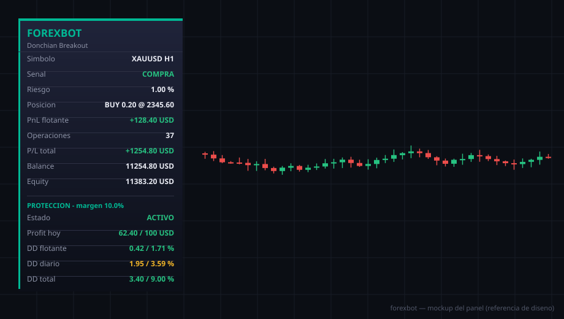

# forexbot — versión nativa MQL5 (EA + indicador)

Robot **day trading** que se compila e instala dentro de MetaTrader 5, sin
Python. Incluye un **Expert Advisor** (`forexbot.mq5`) y un **indicador gráfico**
acompañante (`forexbot_signals.mq5`).

- **Dos estrategias** (las más robustas de las probadas): **Donchian breakout** y
  **MACD trend**.
- Pensado para operar **Oro (XAUUSD), NZDCAD y EURUSD** (un EA por gráfico).
- **Day trading**: cierra todo al final del día, no mantiene posiciones overnight.
- Una sola posición por símbolo, stops por ATR. **Sin grid, hedging, HFT ni
  martingala.**
- **Protección para prop firm** integrada (DD diario, total, flotante y objetivo
  de profit), todo configurable.

> ⚠️ El conjunto de estrategias es una base sólida, pero **ninguna estrategia es
> rentable "de fábrica"** en todos los mercados. Hay que **optimizar los
> parámetros con el Strategy Tester** sobre datos reales de tu bróker para cada
> símbolo. Los presets son puntos de partida, no garantías.

## Estrategias

| `InpStrategy`             | Tipo        | Idea                                              |
|---------------------------|-------------|---------------------------------------------------|
| `STRAT_DONCHIAN_BREAKOUT` (0) | Ruptura  | Rompe el máximo/mínimo de las N velas previas.   |
| `STRAT_MACD_TREND` (1)        | Momentum | Cruce MACD filtrado por una EMA de tendencia.    |

Ambas usan stop y objetivo por ATR (`InpAtrStop`, `InpAtrTarget`).

## Instalar el EA

1. En MT5: **Archivo → Abrir carpeta de datos**.
2. Copia [`Experts/forexbot.mq5`](Experts/forexbot.mq5) en **`MQL5\Experts`**.
3. **F4** (MetaEditor) → abre `forexbot.mq5` → **F7** (Compilar). 0 errores → genera `forexbot.ex5`.

## Instalar el indicador

1. Copia [`Indicators/forexbot_signals.mq5`](Indicators/forexbot_signals.mq5) en
   **`MQL5\Indicators`**.
2. En MetaEditor, ábrelo y **F7** (Compilar).
3. En MT5, **Navegador → Indicadores → forexbot signals** y arrástralo al gráfico.

El indicador dibuja **flechas de compra/venta** donde la estrategia daría señal y,
opcionalmente, el **canal Donchian**. Sirve para *ver* dónde entraría el robot.
Configura `InpStrategy` igual que en el EA para que coincidan.

## Cómo operar Oro, NZDCAD y EURUSD

El EA opera **el símbolo de su gráfico**, así que adjúntalo **una vez por símbolo**:

1. Abre el gráfico de **XAUUSD** en **M15** → arrastra `forexbot` → pestaña
   *Entradas* → **Cargar** `presets/forexbot_XAUUSD.set`.
2. Repite con **EURUSD** (`forexbot_EURUSD.set`) y **NZDCAD**
   (`forexbot_NZDCAD.set`).
3. Marca *Permitir trading algorítmico* y activa el botón **Algo Trading**.

Cada preset usa un **número mágico distinto** (234001/2/3), así no se pisan entre
gráficos.

## Day trading (sin overnight)

| Parámetro          | Defecto | Qué hace                                              |
|--------------------|--------:|-------------------------------------------------------|
| `InpCloseEndOfDay` | true    | Cierra todas las posiciones del EA al final del día.  |
| `InpCloseHour/Minute` | 23:30 | Hora (servidor) del cierre diario.                  |
| `InpUseSession`    | false   | Limita las **entradas** a una franja horaria.         |
| `InpSessionStart/End` | 7–20 | Franja de sesión (hora servidor) si se activa.       |

Así el bot **no deja trades abiertos overnight**. Opera en temporalidades
intradía (M5/M15) — el preset usa **M15**.

## Gestión de la operación (trailing + break-even)

Para que las ganadoras puedan crecer y no queden más pequeñas que las
perdedoras, el EA gestiona el stop de cada posición (grupo *Gestión de la
operación*):

| Parámetro            | Defecto | Qué hace                                                  |
|----------------------|--------:|-----------------------------------------------------------|
| `InpUseBreakEven`    | true    | Mueve el SL a break-even cuando la operación gana.        |
| `InpBreakEvenATR`    | 1.0     | Activa el break-even tras este profit (en ATR).           |
| `InpBreakEvenLockATR`| 0.1     | Cuánto bloquea por encima de la entrada al hacer BE (ATR).|
| `InpUseTrailing`     | true    | Trailing stop por ATR (deja correr la ganancia).          |
| `InpTrailStartATR`   | 1.5     | Empieza a seguir tras este profit (ATR).                  |
| `InpTrailDistATR`    | 2.0     | Distancia del trailing (ATR).                             |

Con esto, el objetivo (`InpAtrTarget`) se sube a 4.0 ATR para dejar correr, y el
trailing protege la ganancia por el camino.

## Panel visual

Panel oscuro con degradado que se refresca cada segundo y muestra: símbolo/TF,
señal (bias), riesgo %, posición, **PnL flotante**, operaciones, **P/L total**,
balance, equity y la sección **PROTECCIÓN**.

## Protección para prop firm

Cuatro controles configurables (grupo *Protección*):

| Parámetro            | Defecto | Qué controla                                          |
|----------------------|--------:|-------------------------------------------------------|
| `InpMaxFloatDDPct`   | 1.9 %   | DD de PnL flotante **por símbolo** → cierra ese símbolo. |
| `InpMaxDailyDDPct`   | 3.99 %  | DD diario → cierra todo y pausa el día.               |
| `InpMaxTotalDDPct`   | 10.0 %  | DD total → cierra todo y detiene.                     |
| `InpDailyProfitTarget` | 100   | Objetivo de profit diario → pausa el día al lograrlo. |
| `InpDailyBase`       | Balance del día | Base del DD diario/flotante.                  |
| `InpSafetyMarginPct` | 10.0 %  | Margen: corta en el límite **efectivo = límite×(1−margen)**. |
| `InpCloseOnTarget`   | true    | Cerrar posiciones al lograr el objetivo.              |
| `InpResetGuard`      | false   | Reiniciar contadores (nuevo desafío).                 |

- **Todos los DD se miden sobre BALANCE** (no equity): total contra el balance
  inicial; diario/flotante contra el balance de inicio de día.
- El **margen de seguridad** hace que el EA corte antes de tocar la regla real
  (con 10%: diario 3.99%→3.59%, total 10%→9%, flotante 1.9%→1.71%).
- El balance de inicio de día, el capital de referencia y el bloqueo se
  **persisten en variables globales del terminal** (sobreviven a reinicios).
- Para un **nuevo desafío**: carga el EA con `InpResetGuard = true` una vez y
  vuelve a `false`.

> **Importante (regla de oro):** el riesgo por operación **no debe superar** el
> corte de flotante por símbolo. Si arriesgas 2% pero el corte de flotante es
> 1.9%×(1−margen)=1.71%, la protección cierra la operación **antes** de que
> llegue su stop, generando pérdidas raras. Mantén `InpRiskPerTrade` ≤ flotante
> efectivo (por eso los presets usan 0.5–1%).

## Presets (.set)

En [`presets/`](presets/): `forexbot_XAUUSD.set`, `forexbot_EURUSD.set`,
`forexbot_NZDCAD.set`. Todos en M15, day trading, con la protección activa.
Cárgalos desde la pestaña *Entradas* del EA o del Strategy Tester (**Cargar**).

## Optimizar / probar (IMPRESCINDIBLE)

Estas estrategias **no son rentables "de fábrica"**; hay que ajustarlas a cada
símbolo con datos reales. Pasos:

1. **Ver → Probador de estrategias** (**Ctrl+R**), modo *"Cada tick basado en
   ticks reales"*.
2. Usa un periodo **largo y representativo** (≥ 2–3 años, no 2 meses) que incluya
   distintos regímenes de mercado. Reserva un tramo final para validar (out-of-sample).
3. Activa **Optimización** y barre estos rangos como punto de partida:

   | Parámetro          | Desde | Paso | Hasta |
   |--------------------|------:|-----:|------:|
   | `InpDonchianPeriod`| 15    | 5    | 60    |
   | `InpAtrStop`       | 1.0   | 0.5  | 3.0   |
   | `InpAtrTarget`     | 2.0   | 0.5  | 6.0   |
   | `InpTrailStartATR` | 1.0   | 0.5  | 3.0   |
   | `InpTrailDistATR`  | 1.0   | 0.5  | 4.0   |
   | `InpMacdTrendPeriod` | 50  | 25   | 200   |

4. Optimiza por **Factor de Beneficio** o *Custom*, y desconfía de resultados con
   pocos trades. Valida el mejor set en el tramo out-of-sample y en otro símbolo.

> Empieza **siempre** en cuenta **demo**. Trading apalancado = alto riesgo de
> pérdida. Software educativo, **sin garantías de rentabilidad**.

## Notas técnicas

- Indicadores nativos (`iATR`, `iMACD`, `iMA`, `iHighest`/`iLowest`) + `CTrade`.
- Señales evaluadas sobre la **vela cerrada** (shift 1 vs 2).
- El EA identifica sus posiciones por **número mágico**.
